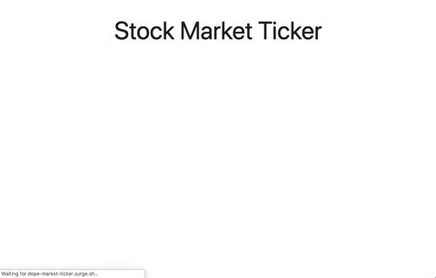

# Stock Market Ticker

An early concept for a game challenging a user to try beat the market for a random stock at a random time-period.

The scene is that every 500ms a new data point is added to the graph, and the user would be allowed to buy and sell 3 times throughout the round, naturally not knowing where this stock is going as the data points are added.

